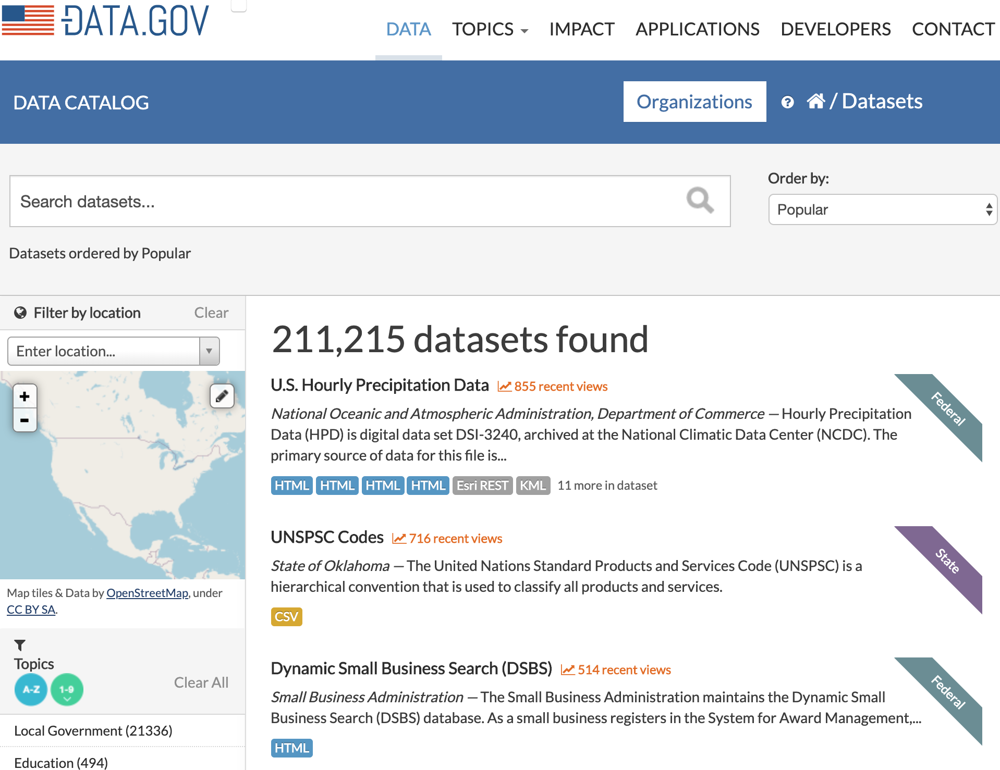
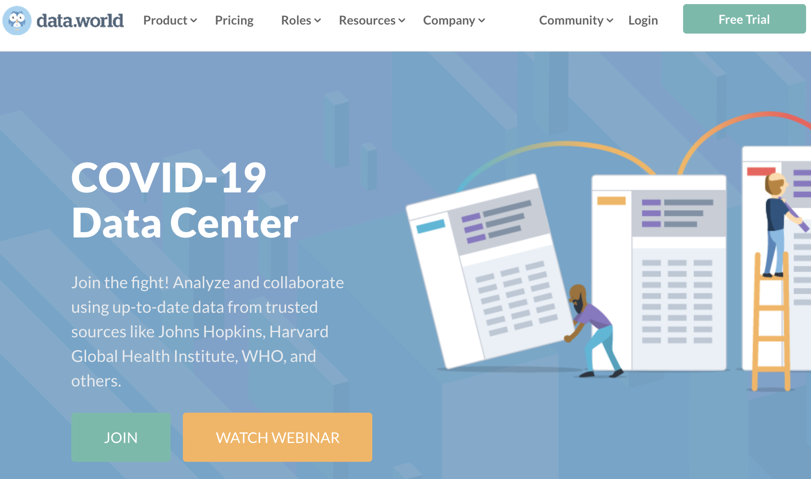
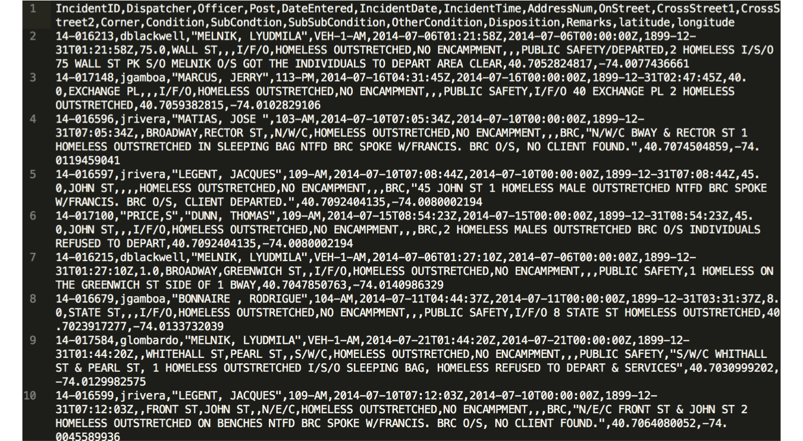
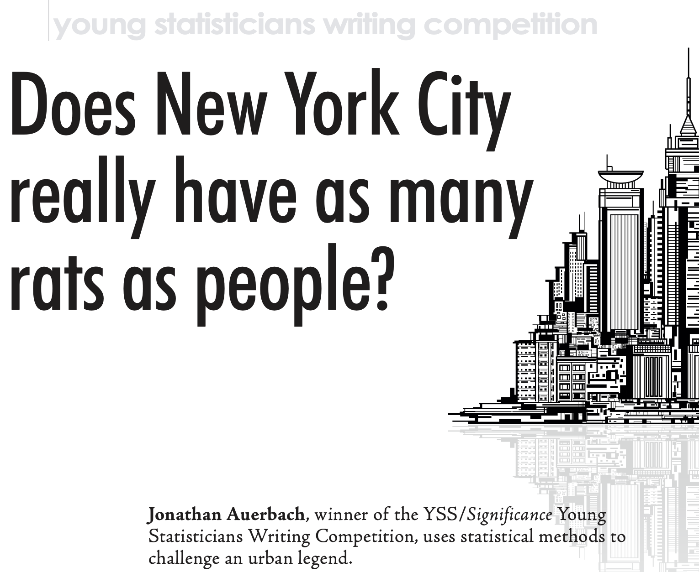
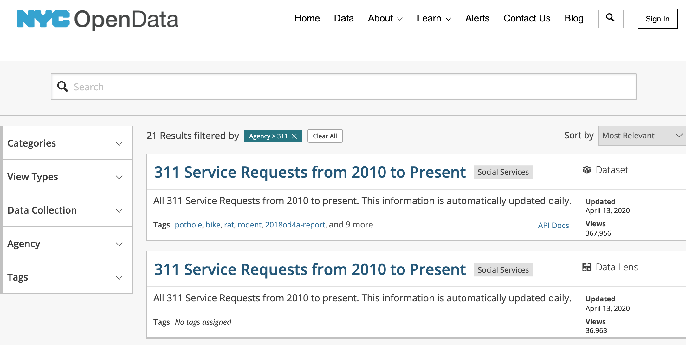

layout:true

  
  
Using Open Data in Research: Opportunities and Challenges

  

    
    
      
      

--

class: center,middle

# Using Open Data in Research: Opportunities and Challenges

- - -

## Facilitator: Richard Dunks

### Follow along at: http://bit.ly/open-data-in-research

#### See the code at: http://bit.ly/open-data-in-research-code

<strong><strong>Using Open Data in Research: Opportunities and Challenges</strong></strong> by <a xmlns:cc="http://creativecommons.org/ns#" href="https://www.datapolitan.com" property="cc:attributionName" rel="cc:attributionURL">Richard Dunks</a> is licensed under a <a rel="license" href="http://creativecommons.org/licenses/by-sa/4.0/">Creative Commons Attribution-ShareAlike 4.0 International License</a>

---

class:center,middle
# Welcome

---
exclude:true

# [Zoom Drill](https://vimeo.com/407215417)
+ Mute and Unmute your microphone
+ Start and Stop your video
+ Post a message in the Chat window with your name and computer operating system (Windows or MacOS)
+ Click the Participants window and Raise your hand 
???
+ Facilitators will cover the following skills: muting themselves, stopping their video, typing in chat box, raising their hand, sharing their screen

---
exclude:true
# A Few Ground Rules
+ Step up, step back
+ One mic
+ Be curious and ask questions in the chat box
+ Assume noble regard and positive intent
+ Respect multiple perspectives 
+ Be present (phone, email, social media, etc.)
???
+ Facilitators establish the intention we have for the culture of the classroom

---
exclude:true
# Ground Rules

---

# Introduction

---

name:open-data
# Definition of Open Data
--

> Open data is data that can be freely used, shared and built-on by anyone, anywhere, for any purpose

## - [Open Knowledge International](http://blog.okfn.org/2013/10/03/defining-open-data/)

---

# Key Features of Open Data
--

+ Availability and access
--

.caption[[Data.gov](https://www.data.gov/)]

---

# Key Features of Open Data
+ Availability and access
+ Reuse and redistribution
--

.caption[[data.world](https://data.world/)]

---

# Key Features of Open Data
+ Availability and access
+ Reuse and redistribution
+ Universal participation
--

---

# Why is this Important?

.caption[[Article link](https://rss.onlinelibrary.wiley.com/doi/pdf/10.1111/j.1740-9713.2014.00764.x)]

---
# Accessing Open Data

.caption[[Link to NYC Open Data Portal](https://opendata.cityofnewyork.us/)]

---

# .center[Live Demo]

---

# Resources
--

+ [Open Data Handbook](http://opendatahandbook.org/)
--

+ [State of the Union of Open Data](https://www.datafoundation.org/the-state-of-the-union-of-open-data-ed-3)
--

+ [Open Data 500](https://www.opendata500.com/)

---

# Final Thought

---

# Contact Information
+ [Email me](mailto:richard[at]datapolitan[dot]com)
+ Check out [my website](https://wwww.datapolitan.com)
+ Connect on [Twitter](https://twitter.com/Datapolitan)
+ Connect on [LinkedIn](https://www.linkedin.com/in/richarddunks/)
+ Follow on [Instagram](https://www.instagram.com/datapolitan/)

---

class:middle,center
# Thank You!

