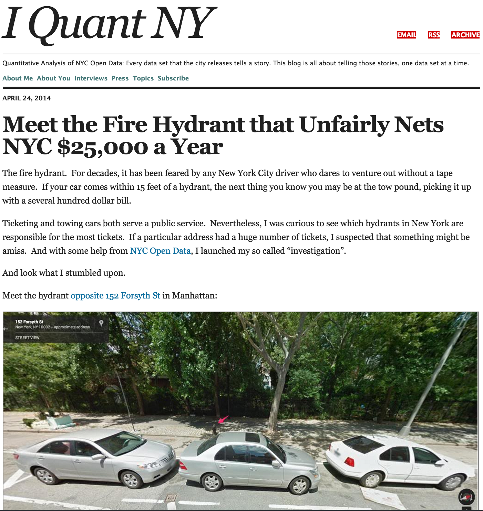
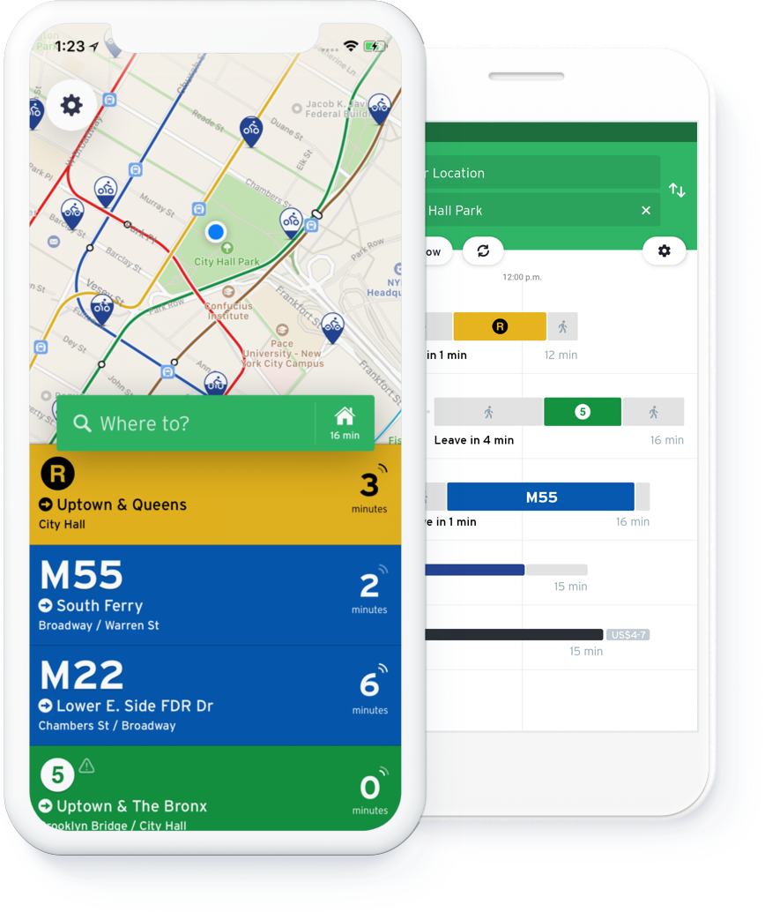

layout:true

  
  
Using Open Data in Research: Opportunities and Challenges

  

    
    
      
      

--

class: center,middle

# Using Open Data in Research: Opportunities and Challenges

- - -

## Facilitator: Richard Dunks

### Follow along at: http://bit.ly/open-data-in-research

#### See the code at: http://bit.ly/open-data-in-research-code

<strong><strong>Using Open Data in Research: Opportunities and Challenges</strong></strong> by <a xmlns:cc="http://creativecommons.org/ns#" href="https://www.datapolitan.com" property="cc:attributionName" rel="cc:attributionURL">Richard Dunks</a> is licensed under a <a rel="license" href="http://creativecommons.org/licenses/by-sa/4.0/">Creative Commons Attribution-ShareAlike 4.0 International License</a>

---

class:center,middle
# Welcome

---
exclude:true

# [Zoom Drill](https://vimeo.com/407215417)
+ Mute and Unmute your microphone
+ Start and Stop your video
+ Post a message in the Chat window with your name and computer operating system (Windows or MacOS)
+ Click the Participants window and Raise your hand 
???
+ Facilitators will cover the following skills: muting themselves, stopping their video, typing in chat box, raising their hand, sharing their screen

---
exclude:true
# A Few Ground Rules
+ Step up, step back
+ One mic
+ Be curious and ask questions in the chat box
+ Assume noble regard and positive intent
+ Respect multiple perspectives 
+ Be present (phone, email, social media, etc.)
???
+ Facilitators establish the intention we have for the culture of the classroom

---
exclude:true
# Ground Rules

---

# Why You Should Pay Attention
--

+ I'll show you where to get government open data
--

+ I'll talk about how to use that data
--

+ I'll connect it back to using it in research

---

# Introduction

--

+ Trained in sociology and computer science
--

+ 6 years an analyst in the public sector
--

+ 7 years a consultant and trainer with open data
--

+ Involved with the open data movement locally, nationally, and globally

---

name:open-data
# Definition of Open Data
--

> Open data is data that can be freely used, shared and built-on by anyone, anywhere, for any purpose

## - [Open Knowledge International](http://blog.okfn.org/2013/10/03/defining-open-data/)

---

# Government Open Data
--

+ Produced by local, county, state, and federal entities agencies
--

+ Often describes the actions of government
--

+ Intended for administration, not research
--

+ Produced at tax-payer expense

---

# Key Features of Open Data
--

+ Availability and access
--

.caption[[Data.gov](https://www.data.gov/)]

---

# Key Features of Open Data
+ Availability and access
+ Reuse and redistribution
--

.caption[[data.world](https://data.world/)]

---

# Key Features of Open Data
+ Availability and access
+ Reuse and redistribution
+ Universal participation
--

---

# Why is this Important?
--

.caption[[Article link](https://rss.onlinelibrary.wiley.com/doi/pdf/10.1111/j.1740-9713.2014.00764.x)]

---
# Accessing Open Data

.caption[<a href="https://opendata.cityofnewyork.us/" target="_blank">Link to NYC Open Data Portal</a>]

---

# .center[Live Demo]

---

# Benefits of Open Data
--

+ Transparency
--

---

# Benefits of Open Data
+ Transparency
+ Releasing social and commercial value
--

.caption[[AccuWeather](https://www.accuweather.com/)]

---

# Benefits of Open Data
+ Transparency
+ Releasing social and commercial value

.caption[[TransitApp.com](https://transitapp.com/)]

---

# Benefits of Open Data
+ Transparency
+ Releasing social and commercial value

.caption[Source: [NPR](https://www.npr.org/sections/thesalt/2015/03/27/395622262/did-that-restaurant-pass-its-health-inspection-now-yelp-will-tell-you)]

---

# Benefits of Open Data
+ Transparency
+ Releasing social and commercial value
+ Participation and engagement
--

.caption[[Voting Information Project](https://www.votinginfoproject.org/)]

---

# Benefits of Open Data
+ Transparency
+ Releasing social and commercial value
+ Participation and engagement
+ Studies of social, economic, and political trends

---

class:center,middle

# Open Data Concerns

---

# Privacy
--

+ Personally identifiable information (PII)

.caption[Source: [Gawker](http://gawker.com/the-public-nyc-taxicab-database-that-accidentally-track-1646724546)]

---

# Privacy
+ Personally identifiable information (PII)

.caption[Source: [The Interdisciplinary Internet Institute](https://web.archive.org/web/20150318175539/http://theiii.org/index.php/997/using-nyc-taxi-data-to-identify-muslim-taxi-drivers/)]

---

# Privacy
+ Personally identifiable information (PII)
+ [Mosaic Effect](https://fcw.com/articles/2014/05/13/fose-mosaic.aspx)
--

.caption[The Center for Government Excellence's [Privacy Matrix](https://govex.jhu.edu/wiki/privacy_matrix/)]

---

# Reliability
--

+ Accuracy
--

.caption[Source: [TimberBiz](https://www.timberbiz.com.au/fire-app-sync-reality/)]

---

# Reliability
+ Accuracy
+ Timeliness
--

.caption[[NOAA National Climatic Data Center](https://www.ncdc.noaa.gov/cdo-web/)]

---

# Security
--

+ Identify sensitive infrastructure
--

.caption[[Open Sewer Atlas](http://openseweratlas.tumblr.com/map)]

---

# Is This Data [Research Quality](https://simplystatistics.org/2019/05/29/research-quality-data-and-research-quality-databases/)?
--

+ Is summarized the right amount? 
--
.blue[ Not usually]
--

+ Is formatted to work with the tools you are going to use? 
--
.blue[ Mostly]
--

+ Is easy to manipulate and use? 
--
.blue[ Eh...]
--

+ Is valid and accurately reflects the underlying data collection? 
--
.blue[ I wish...]
--

+ Has potential biases clearly documented? 
--
.blue[ Rarely]
--

+ Combines all the relevant data types you need to answer questions? 
--
.blue[ Usually needs to be joined with other data]

---

class:center,middle
# Questions?

---

# Final Thoughts
--

+ Open data has a lot of uses, but isn't research quality off the portal
--

+ Don't take it at face value
--

+ Be clear about your assumptions/expectations and be ready to be surprised 
--
 _or annoyed and frustrated..._
--

+ Make sure you take the time to research context and reach out to data experts when necessary

---

# Resources
--

+ [Open Data Handbook](http://opendatahandbook.org/)
--

+ [State of the Union of Open Data](https://www.datafoundation.org/the-state-of-the-union-of-open-data-ed-3)
--

+ [Open Data 500](https://www.opendata500.com/)
--

+ [Research Quality Datasets from SimplyStatistics.org](https://simplystatistics.org/2019/05/29/research-quality-data-and-research-quality-databases/)

---

# Contact Information
+ [Email me](mailto:richard[at]datapolitan[dot]com)
+ Check out [my website](https://wwww.datapolitan.com)
+ Connect on [Twitter](https://twitter.com/Datapolitan)
+ Connect on [LinkedIn](https://www.linkedin.com/in/richarddunks/)
+ Follow on [Instagram](https://www.instagram.com/datapolitan/)

---

class:middle,center
# Thank You!

